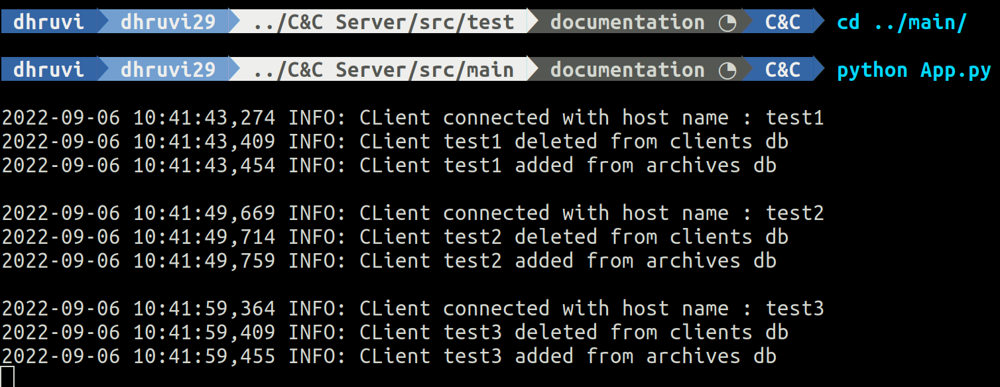
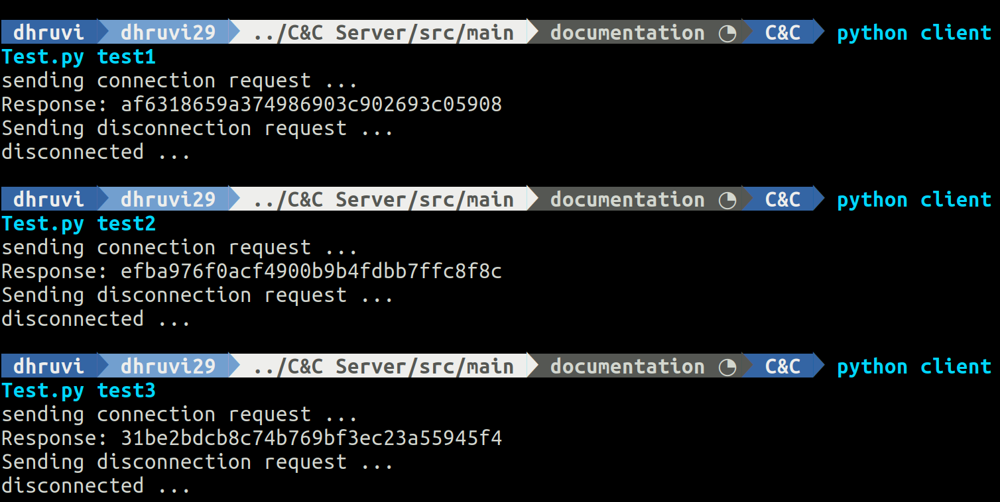

# C&C Server

## Description
C&C server should have the Probe registering mechanism. And it listens to registered Prob's heartbeats.  WebUI shows the active states of Probes in a list view.

## Implemeted Functionalities
* Registering mechanism for Probe
* Disconnecting mechanism for Probe
* Storing Probe information in database
* Logging mechanism
* Packaging
* Test suite

## Technology stack
* gRPC
* protobuf
* SQLite
* dpkg suite

## Folder Structure
```
.
├── debian
├── src
│   ├── main
│   │   ├── data
│   │   │   ├── ClientDao.py
│   │   │   ├── DataUtils.py
│   │   │   └── DbHelper.py
│   │   ├── service_methods
│   │   │   ├── grpc_bin
│   │   │   │   ├── survey6_pb2_grpc.py
│   │   │   │   └── survey6_pb2.py
│   │   │   ├── ClientConnectionService.py
│   │   │   └── UtilsService.py
│   │   ├── App.py
│   │   └── Utils.py
│   └── test
│       └── test_server.py
├── cnc-server
├── requirements.txt
└── server.service
```

## Server Setup
1. Clone the repository
```
git clone https://github.com/web-telescope/survey6.git
```
2. Move to C&C Server
```
cd C\&C\ Server/
```
3. Create and activate virtual environment
```
python3 -m pip install --user virtualenv
python3 -m venv env
source env/bin/activate
```
4. Install Requirements
```
python3 -m pip install -r requirements.txt
```

## Activate Server
1. Move to src/main
```
cd src/main
```
2. Run the server
```
python App.py
```

## Server Testing
1. Move to `src/test` from `C&C Server`
```
cd src/test
```
2. Run tests
```
python test_server.py
```
## Server Packaging

### Packaging
1. Come to `C&C Server` dir
2. Run dpkg
```
dpkg-buildpackage -b -rfakeroot -us -uc
```

### Package Installation
1. Considering you are in `C&C Server` dir,
``` 
sudo apt-get install ../cnc-server_0.1.0-1_all.deb
```

## Screenshots



### Testing


## Video Demo