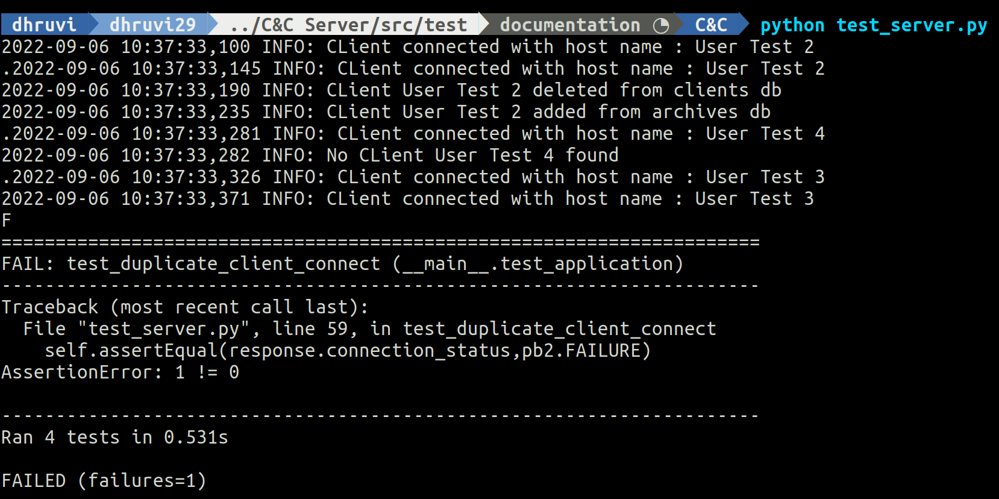

# Test
```
python test_server.py
```
## List of server tests performed
* test_client_connect
* test_duplicate_client_connect
* test_client_disconnect_correct_uid
* test_client_disconnect_incorrect_uid

## Output


### Failing test case:
Server should not process multiple connection requests from same client. This gives an easy way for flood attacks. Have to fix this.