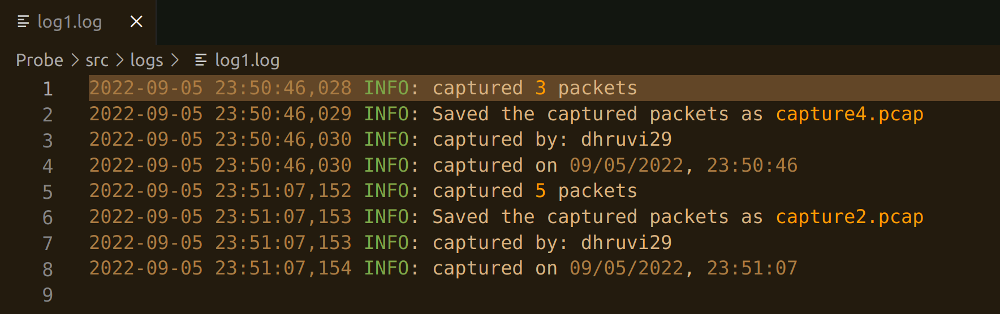
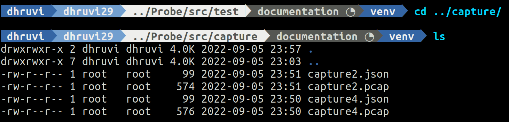

# Network Probe

## Description
Intercept and collect all the ipv6 traffics (regardless of the protocol) therefore libpcap is preferable. probe binaries must run as a service of the operating system (OS could be Linux host).  Moreover, the probe cast a heartbeat to the C&C server for its heath checks mechanisms. This must be implemented using grpc.  Probe identifies ideal states of the host network interface and uses those time windows to send the collected ipv6 pcap.  For this. This data must be annotated with meta-information for aggregation purposes (meta information could be discussed) 

## Current Functionalities
* Sniffs and captures all the ipv6 traffics. 
* Saves captured packets and stores the metadata in a json file.

## Technology stack
* scapy
* grpc
* protobuf

## Folder Structure
.
├── capture
├── logs
├── src
│   ├── main
│   │   └── data_collector.py
│   └── test
│       └── test_data_collector.py
└── requirements.txt

`capture` containes captured `.pcap` files as well as their metadata `.json` files

## Probe Setup  
1. Clone the repository
```
git clone https://github.com/web-telescope/survey6.git
```
2. Move to Probe
```
cd Probe
```
3. Create and activate virtual environment
```
python3 -m pip install --user virtualenv
python3 -m venv env
source env/bin/activate
```
4. Install Requirements
```
python3 -m pip install -r requirements.txt
```

## Usage
1. Import `src/main/data_collector.py` and use `dataCapture()` method. [
Example use case is in [src/test](./src/test/test_data_collector.py)]
> Run the scripts using `sudo` as capturing the packets on the system requires elevated access.

## Screenshots



