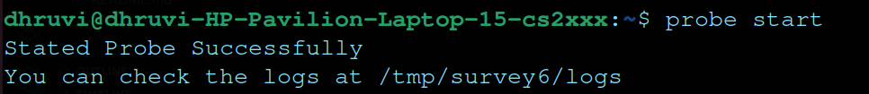
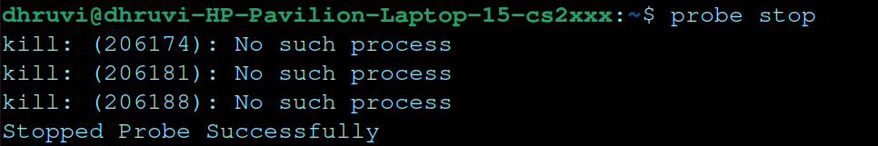

# Network Probe

## Description
Intercept and collect all the ipv6 traffics (regardless of the protocol) therefore libpcap is preferable. probe binaries must run as a service of the operating system (OS could be Linux host).  Moreover, the probe cast a heartbeat to the C&C server for its heath checks mechanisms. This must be implemented using grpc.  Probe identifies ideal states of the host network interface and uses those time windows to send the collected ipv6 pcap.  For this. This data must be annotated with meta-information for aggregation purposes (meta information could be discussed)

### Detailed Wiki:

1. [How to use the probe package with cli? (Probe manual page)](#how-to-use-the-probe-package-with-cli-probe-manual-page)
2. [How does the probe make connection to the server and how is the probe traced?](#how-does-the-probe-make-connection-to-the-server-and-how-is-the-probe-traced)
3. [How and what metadata is captured and sent?](#what-metadata-is-captured-and-how-is-it-sent)
4. [Where is the captured data and logs stored on the probe?](#where-is-the-captured-data-and-logs-stored-on-the-probe) 
5. [Where exactly is the data sent in the server?](#where-exactly-is-the-data-sent-in-the-server)


## Current Functionalities
* Sniffs and captures all the ipv6 traffics. 
* Saves captured packets and stores the metadata in a json file.
* Sends the data packets to the server at the frequency of 60 secs
* Sends connection and disconnection request to the C&C Server
* Periodically sends heartbeats to the server for the health check mechanism

## Technology stack
* scapy
* grpc
* protobuf

## Folder Structure
```
.
├── debian
│   ├── changelog
│   ├── cnc-server.substvars
│   ├── compat
│   ├── control
│   ├── files
│   ├── install
│   ├── postinst
│   ├── preinst
│   └── probe
│       └── DEBIAN
│           ├── control
│           ├── md5sums
│           ├── postinst
│           └── preinst
├── probe
├── README.md
├── requirements.txt
└── src
    ├── main
    │   ├── config.py
    │   ├── connection_request.py
    │   ├── data_collector.py
    │   ├── data_transfer.py
    │   ├── disconnection_request.py
    │   ├── grpc_bin
    │   │   ├── survey6_pb2_grpc.py
    │   │   └── survey6_pb2.py
    │   ├── heartbeat.py
    │   └── utils.py
    └── test
        └── test_data_collector.py
```
- `debian`: files for debian packages
- `probe`: command line script for probe
- `src\main\`: source files


## Probe Setup  
1. Clone the repository
```
git clone https://github.com/web-telescope/survey6.git
```
2. Move to Probe
```
cd Probe
```
3. Create and activate virtual environment
```
python3 -m pip install --user virtualenv
python3 -m venv env
source env/bin/activate
```
4. Install Requirements
```
python3 -m pip install -r requirements.txt
```

## Probe Packaging

### Packaging
1. Come to `Probe` dir
2. Run dpkg
```
dpkg-buildpackage -b -rfakeroot -us -uc
```

### Package Installation
1. Considering you are in `Probe` dir,
``` 
sudo apt-get install ../probe_0.1.0-1_all.deb 
```


## Wiki
### How to use the probe package with cli? (Probe manual page)
Once, the probe is installed as a debian package, we are ready to use it from the command line. Following are the commands and their description: 
```
probe start
```
* Sends a connection request to the server
* Starts data collector service
* Starts data transfer service to transfer the collected data to the server at interval of 60 seconds for now.
* Starts the heartbeat service to send heartbeat to the server at regular interval of 3 seconds.


```
probe stop
```
* Sends a disconnection request the probe
* Stops data collector, data transfer and heartbeat services

### How does the probe make connection to the server and how is the probe traced?
* We got to setup the `.env` to have `GRPC_SERVER`. Default for local setup is `[::]:32001`
* Probe runs `connection_request.py` where it makes a call `ClientConnect` to the server along with its hostname and a timestamp.
* Upon a successfull connection, the server sends a unique ID for the probe which will be further used to track it for all futher actions.
* This is ID is by default stored in `/tmp/survey6/uid.id`. However, we can specify its path in `.env` in `UID_FILE_PATH` 

### What metadata is captured and how is it sent?
Generate only one metadata file with name `**uid**.json`
Includes following details:
```
{
    "UID": "33f721f8128c4aea98c54f299b66ed60",
    "sysname": "Linux",
    "nodename": "dhruvi-HP-Pavilion-Laptop-15-cs2xxx",
    "release": "5.19.0-46-generic",
    "version": "47~22.04.1-Ubuntu SMP PREEMPT_DYNAMIC Wed Jun 21 15:35:31 UTC 2",
    "machine": "x86_64",
    "Number of packets captured per .pcap": 5,
    "CPU Count": 8,
    "total memory": 8011096,
    "all interfaces": [
        "lo",
        "eno1",
        "wlo1"
    ],
    "sniff interface": "wlo1",
    "ip4 address": "x.x.x.x",
    "mac address": "x: x: x: x: x: x"
}
```
This json file is transfered along with the other .pcap files to the server.
### Where is the captured data and logs stored on the probe?
You can set in the `.env`, variable `CAPTURED_PACKET_PATH` for captured files and variable `LOG_PATH` for log files. 
> Default values: 
> CAPTURED_PACKET_PATH : `/tmp/survey6/capture/`
> LOG_PATH: `/tmp/survey6/logs/`


FYI: directory structure of `/tmp/survey6`
```

├── capture (dir)
├── logs (dir)
└── uid.id (file)
```
### Where exactly is the data sent in the server?
`DataAgreegatorIP:clientEnd`
extra: [directory structure of data aggregator]()

